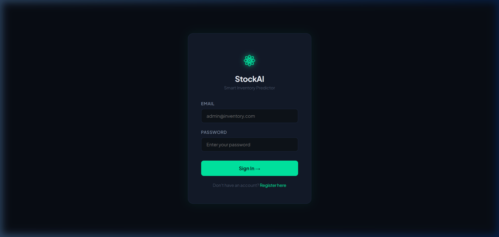
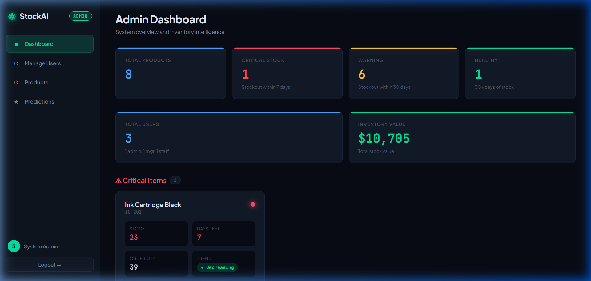
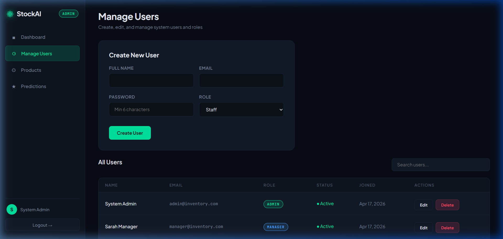
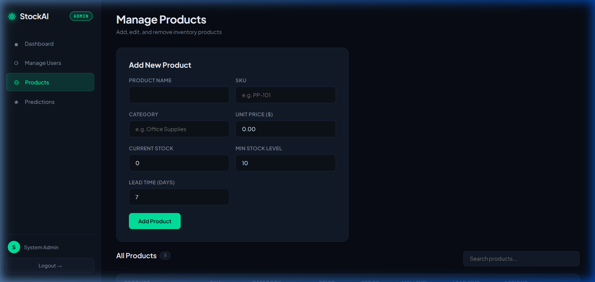
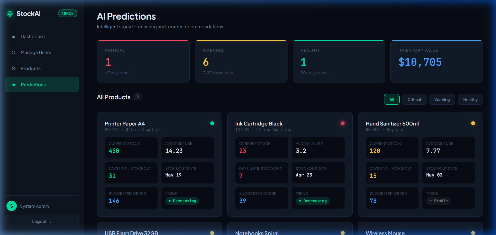
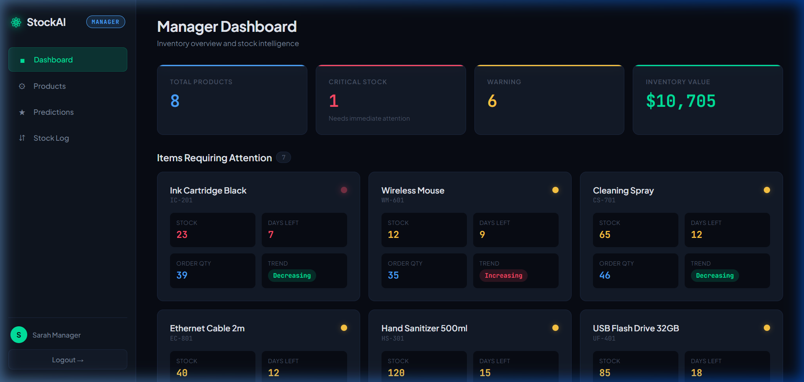
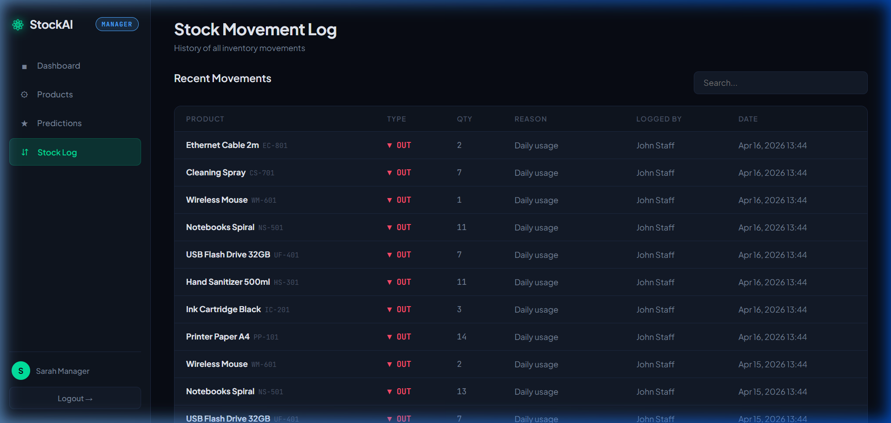
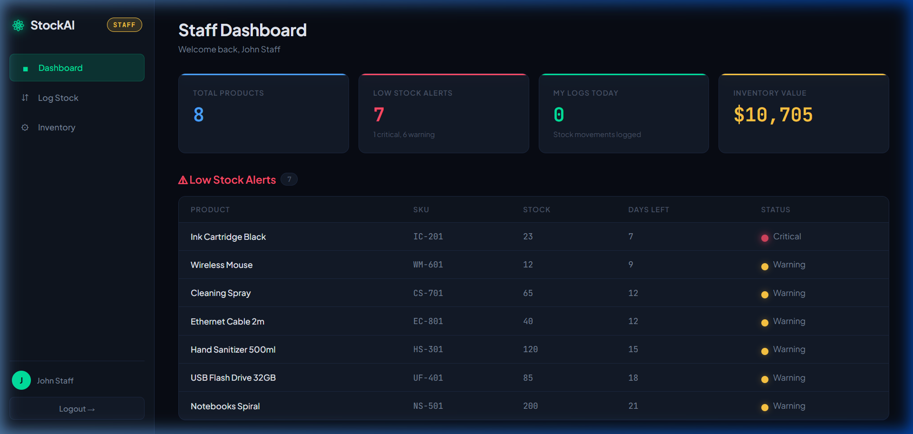
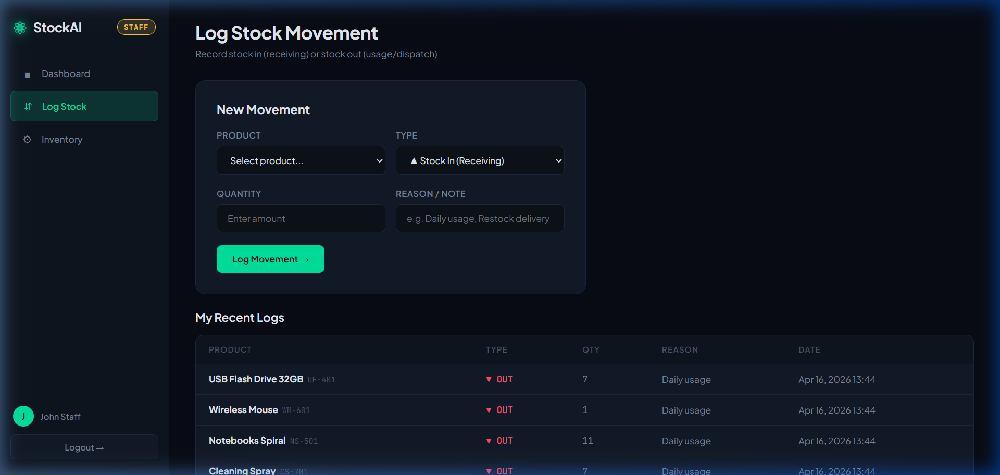
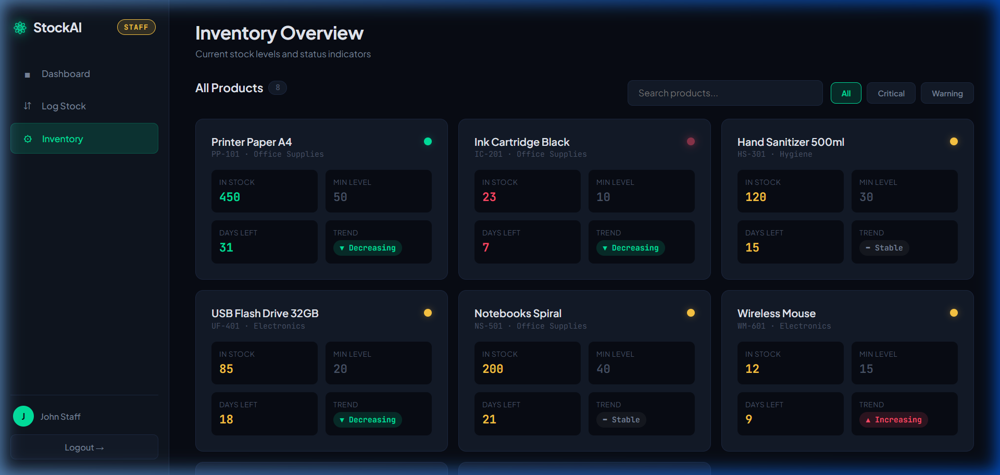

# StockAI — Smart Inventory Predictor

> **SE322 Course Project** — A full-stack inventory management system with AI-powered stock prediction, built with HTML, CSS, JavaScript, PHP, and MySQL.

---

## Table of Contents

1. [Project Overview](#project-overview)
2. [Features](#features)
3. [Tech Stack](#tech-stack)
4. [System Architecture](#system-architecture)
5. [The AI Prediction Engine](#the-ai-prediction-engine)
6. [Database Schema](#database-schema)
7. [Folder Structure](#folder-structure)
8. [Installation & Setup](#installation--setup)
9. [Default Accounts](#default-accounts)
10. [Role-Based Access Control](#role-based-access-control)
11. [Functional Requirements by Team Member](#functional-requirements-by-team-member)
12. [Screenshots Guide](#screenshots-guide)
13. [How to Use](#how-to-use)
14. [Team Members](#team-members)

---

## Project Overview

**StockAI** is a smart inventory management system designed for small businesses and warehouses. It tracks products, logs stock movements (in/out), and uses an **AI-powered prediction engine** to forecast when items will run out — providing reorder recommendations, trend analysis, and visual alerts.

The system demonstrates full integration between:
- **Frontend** — HTML, CSS, JavaScript
- **Backend** — PHP (server logic, authentication, CRUD operations)
- **Database** — MySQL (data storage, queries, relationships)

All CRUD operations (Create, Read, Update, Delete) are implemented across users, products, and stock movements.

---

## Features

### Core Features
- **User Authentication** — Secure login/register with hashed passwords (bcrypt)
- **Role-Based Access Control** — 3 roles: Admin, Manager, Staff
- **Product Management** — Full CRUD for inventory products
- **Stock Movement Logging** — Track every stock-in and stock-out with timestamps
- **AI Prediction Engine** — Forecasts stockout dates, suggests reorder quantities, detects demand trends

### Dashboard Features
- Real-time inventory stats (total products, critical alerts, inventory value)
- Color-coded status indicators (Green / Yellow / Red)
- Trend detection badges (Increasing / Stable / Decreasing)
- Searchable and filterable tables
- Recent activity feed

### User Experience
- Dark futuristic UI theme
- Responsive sidebar navigation
- Auto-dismissing alert notifications
- Confirmation dialogs for destructive actions
- Client-side search filtering

---

## Tech Stack

| Layer      | Technology              |
|------------|-------------------------|
| Frontend   | HTML5, CSS3, JavaScript |
| Backend    | PHP 7.4+               |
| Database   | MySQL 5.7+ / MariaDB   |
| Server     | Apache (XAMPP/WAMP)     |
| Fonts      | Google Fonts (Plus Jakarta Sans, JetBrains Mono) |

**No frameworks or libraries required** — pure vanilla code.

---

## System Architecture

```
┌─────────────────────────────────────────────────────────┐
│                      BROWSER                            │
│         HTML + CSS + JavaScript (Frontend)              │
└──────────────────────┬──────────────────────────────────┘
                       │ HTTP Requests
                       ▼
┌─────────────────────────────────────────────────────────┐
│                   APACHE SERVER                         │
│                                                         │
│  ┌──────────┐  ┌──────────────┐  ┌──────────────────┐  │
│  │ auth.php │  │ CRUD Pages   │  │ predict_engine   │  │
│  │ sessions │  │ (admin/mgr/  │  │ .php             │  │
│  │ & roles  │  │  staff)      │  │ (AI Algorithm)   │  │
│  └──────────┘  └──────────────┘  └──────────────────┘  │
│                     PHP Backend                         │
└──────────────────────┬──────────────────────────────────┘
                       │ SQL Queries
                       ▼
┌─────────────────────────────────────────────────────────┐
│                     MySQL                               │
│  users │ products │ stock_movements │ predictions       │
└─────────────────────────────────────────────────────────┘
```

---

## The AI Prediction Engine

Located in `includes/predict_engine.php`, the engine uses a **weighted consumption algorithm**:

### How It Works

```
1. Average Daily Consumption
   avg_daily = total_units_out_last_30_days / 30

2. Days Until Stockout
   days_left = current_stock / avg_daily

3. Predicted Stockout Date
   stockout_date = today + days_left

4. Trend Detection (compares week-over-week usage)
   change% = ((this_week - last_week) / last_week) × 100
   - If change > +20%  → "INCREASING" (demand rising)
   - If change < -20%  → "DECREASING" (demand falling)
   - Otherwise          → "STABLE"

5. Suggested Reorder Quantity
   base_qty = avg_daily × (lead_time_days + safety_buffer)
   - If trend INCREASING → qty × 1.25 (order 25% more)
   - If trend DECREASING → qty × 0.85 (order 15% less)

6. Status Classification
   - CRITICAL (Red)  → stockout within 7 days
   - WARNING (Yellow) → stockout within 30 days
   - HEALTHY (Green)  → 30+ days of stock remaining
```

This creates a system that **adapts to changing demand patterns** — as usage spikes, predictions adjust automatically.

---

## Database Schema

### Entity Relationship Diagram

```
┌──────────┐       ┌────────────┐       ┌──────────────────┐
│  users   │       │  products  │       │ stock_movements  │
├──────────┤       ├────────────┤       ├──────────────────┤
│ id (PK)  │◄──┐   │ id (PK)    │◄──┐   │ id (PK)          │
│ name     │   │   │ name       │   │   │ product_id (FK)──┘
│ email    │   │   │ sku        │   │   │ type (in/out)    │
│ password │   │   │ category   │   │   │ quantity         │
│ role     │   │   │ unit_price │   │   │ reason           │
│ is_active│   └───│ created_by │   │   │ logged_by (FK)───┐
│ created  │       │ cur_stock  │   │   │ created_at       ││
└──────────┘       │ min_stock  │   │   └──────────────────┘│
       ▲           │ lead_time  │   │                       │
       │           └────────────┘   │                       │
       │                            │                       │
       │           ┌────────────┐   │                       │
       │           │predictions │   │                       │
       │           ├────────────┤   │                       │
       │           │ id (PK)    │   │                       │
       │           │ product_id─┘   │                       │
       │           │ avg_daily  │                           │
       │           │ days_left  │                           │
       └───────────│ order_qty  │───────────────────────────┘
                   │ trend      │
                   │ generated  │
                   └────────────┘
```

### Tables

| Table            | Purpose                                         |
|------------------|--------------------------------------------------|
| `users`          | System users with roles and authentication       |
| `products`       | Inventory items with stock levels and settings    |
| `stock_movements`| Log of every stock-in and stock-out transaction  |
| `predictions`    | AI-generated forecasts per product               |

---

## Folder Structure

```
smart-inventory/
│
├── index.php                  # Login page (entry point)
├── register.php               # User registration
├── logout.php                 # Session destroy & redirect
├── setup.php                  # Database setup (run once)
├── db.php                     # Database connection config
├── auth.php                   # Authentication & role helpers
├── README.md                  # This file
│
├── css/
│   └── style.css              # Full dark-theme stylesheet
│
├── js/
│   └── main.js                # Search, filters, UI interactions
│
├── includes/
│   ├── nav.php                # Shared sidebar navigation component
│   └── predict_engine.php     # AI Prediction Algorithm
│
├── admin/                     # Admin-only pages
│   ├── dashboard.php          # Admin overview with stats
│   ├── manage_users.php       # CRUD users & roles
│   ├── manage_products.php    # CRUD products
│   └── predictions.php        # View all AI predictions
│
├── manager/                   # Manager-only pages
│   ├── dashboard.php          # Manager overview
│   ├── manage_products.php    # CRUD products
│   ├── predictions.php        # View AI predictions
│   └── stock_log.php          # View stock movement history
│
├── staff/                     # Staff-only pages
│   ├── dashboard.php          # Staff overview with alerts
│   ├── log_stock.php          # Log stock in/out movements
│   └── inventory.php          # View inventory with status
│
└── screenshots/               # Project screenshots for README
    ├── 01_login.png
    ├── 02_admin_dashboard.png
    ├── 03_manage_users.png
    ├── 04_manage_products.png
    ├── 05_predictions.png
    ├── 06_manager_dashboard.png
    ├── 07_stock_log.png
    ├── 08_staff_dashboard.png
    ├── 09_log_stock.png
    └── 10_staff_inventory.png
```

---

## Installation & Setup

### Prerequisites
- **XAMPP** (recommended) or **WAMP** installed
- PHP 7.4 or higher
- MySQL 5.7+ or MariaDB

### Step-by-Step

1. **Download/Clone** the project folder into your XAMPP htdocs:
   ```
   C:\xampp\htdocs\smart-inventory\
   ```
   (On Mac: `/Applications/XAMPP/htdocs/smart-inventory/`)

2. **Start XAMPP** — Launch Apache and MySQL from the XAMPP Control Panel.

3. **Run Setup** — Open your browser and go to:
   ```
   http://localhost/smart-inventory/setup.php
   ```
   This will:
   - Create the `smart_inventory` database
   - Create all 4 tables
   - Insert default admin, manager, and staff accounts
   - Generate 30 days of sample stock movement data

4. **Login** — Navigate to:
   ```
   http://localhost/smart-inventory/
   ```

That's it! The system is ready to use.

---

## Default Accounts

| Role    | Email                    | Password    |
|---------|--------------------------|-------------|
| Admin   | admin@inventory.com      | admin123    |
| Manager | manager@inventory.com    | manager123  |
| Staff   | staff@inventory.com      | staff123    |

> You can change passwords and create new users from the Admin panel.

---

## Role-Based Access Control

| Feature                  | Admin | Manager | Staff |
|--------------------------|:-----:|:-------:|:-----:|
| View Dashboard           |  ✅   |   ✅    |  ✅   |
| Manage Users (CRUD)      |  ✅   |   ❌    |  ❌   |
| Manage Products (CRUD)   |  ✅   |   ✅    |  ❌   |
| View AI Predictions      |  ✅   |   ✅    |  ❌   |
| Log Stock Movements      |  ❌   |   ❌    |  ✅   |
| View Inventory Status    |  ❌   |   ❌    |  ✅   |
| View Stock Movement Log  |  ✅   |   ✅    |  ❌   |
| Register New Accounts    |  ✅   |   ❌    |  ❌   |

Each role is redirected to their own dashboard upon login. Attempting to access unauthorized pages redirects to the login page.

---

## Functional Requirements by Team Member

### Member 1 — Authentication, User Management & Product CRUD
1. **User Registration & Login** — Secure auth with PHP sessions, password hashing (bcrypt), form validation, and role-based redirects.
2. **Admin User CRUD** — Create, read, update, and delete users. Assign roles (admin/manager/staff). Activate/deactivate accounts.
3. **Product CRUD** — Add, view, edit, and delete products with SKU, category, price, stock levels, and lead time configuration.

**Files:** `index.php`, `register.php`, `logout.php`, `auth.php`, `admin/manage_users.php`, `admin/manage_products.php`, `manager/manage_products.php`

### Member 2 — Stock Management, AI Prediction Engine & Dashboard
4. **Stock Movement Logging** — Staff logs stock-in (receiving) and stock-out (usage) with quantity, reason, and timestamps. Auto-updates product stock levels.
5. **Prediction Algorithm** — Calculates average daily consumption, days until stockout, predicted stockout date, suggested reorder quantity, and demand trend detection.
6. **Dashboard & Visualization** — Role-specific dashboards with stat cards, color-coded alerts (red/yellow/green), trend badges, filterable prediction cards, and searchable tables.

**Files:** `staff/log_stock.php`, `manager/stock_log.php`, `includes/predict_engine.php`, `admin/dashboard.php`, `manager/dashboard.php`, `staff/dashboard.php`, `admin/predictions.php`, `manager/predictions.php`, `staff/inventory.php`

---

## Detailed Project Description & Screenshots

### 1. Login Page — Secure Authentication Gateway

The login page features a sleek dark-themed interface with the StockAI branding. Users enter their email and password to authenticate via PHP sessions with bcrypt-hashed password verification. The system validates credentials server-side and redirects users to their role-specific dashboard (Admin, Manager, or Staff). A "Register here" link is provided for new account creation.



---

### 2. Admin Dashboard — System Overview & Intelligence Hub

The Admin Dashboard provides a comprehensive bird's-eye view of the entire inventory system. It displays real-time stat cards including **Total Products** (8), **Critical Stock** alerts (items running out within 7 days, shown in red), **Warning** items (stockout within 30 days, in yellow), and **Healthy** items (30+ days of stock, in green). Additional cards show **Total Users** (broken down by role) and **Inventory Value** (total monetary value of all stock). Below the stats, a **Critical Items** section highlights products that need immediate attention with their stock level, days left, suggested reorder quantity, and demand trend (Increasing/Stable/Decreasing).



---

### 3. Manage Users — Full User CRUD & Role Assignment

The Manage Users page (Admin-only) enables full CRUD operations on system users. The **Create New User** form allows admins to add users with a Full Name, Email, Password, and assigned Role (Admin/Manager/Staff). Below the form, the **All Users** table displays all registered accounts with their name, email, role badge (color-coded), active status (green dot for active), join date, and action buttons for **Edit** and **Delete**. A search bar enables real-time filtering of the user list.



---

### 4. Manage Products — Inventory Product CRUD

The Manage Products page allows Admins and Managers to perform full CRUD operations on inventory items. The **Add New Product** form includes fields for Product Name, SKU (unique identifier), Category, Unit Price, Current Stock, Minimum Stock Level (threshold for alerts), and Lead Time in Days (used by the AI prediction engine). The **All Products** table below lists all 8 products with searchable columns, showing stock levels, pricing, and action buttons for editing and deleting products.



---

### 5. AI Predictions — Intelligent Stock Forecasting

The Predictions page is the heart of StockAI's intelligence. It displays AI-generated prediction cards for every product, each showing:
- **Status Dot** — Red (Critical: stockout within 7 days), Yellow (Warning: within 30 days), or Green (Healthy: 30+ days)
- **Average Daily Consumption** — Calculated from the last 30 days of stock-out movements
- **Days Until Stockout** — Estimated days before the product runs out
- **Predicted Stockout Date** — The exact date the product is forecasted to hit zero
- **Suggested Reorder Quantity** — AI-calculated quantity adjusted for demand trends
- **Trend Badge** — Increasing (demand rising, orders 25% more), Stable, or Decreasing (demand falling, orders 15% less)

Filter buttons allow quick sorting by status: All, Critical, Warning, or Healthy.



---

### 6. Manager Dashboard — Inventory Overview & Attention Items

The Manager Dashboard mirrors the Admin Dashboard's stat cards (Total Products, Critical Stock, Warning, Inventory Value) but is tailored for the Manager role. It prominently features an **Items Requiring Attention** section that displays a card grid of all products that are in Critical or Warning status. Each card shows the product name, SKU, current stock, days left until stockout, suggested reorder quantity, and the demand trend badge. This gives managers an at-a-glance view of which items need restocking.



---

### 7. Stock Movement Log — Transaction History

The Stock Log page (accessible by Admins and Managers) provides a complete history of all stock movements in the system. The table displays each transaction with the product name, movement type (Stock In or Stock Out, color-coded in green and red respectively), quantity moved, reason for the movement (e.g., "Daily usage", "Weekly restock"), who logged it, and the timestamp. A search bar enables filtering through the movement history.



---

### 8. Staff Dashboard — Low-Stock Alerts & Quick Actions

The Staff Dashboard provides a focused view for warehouse/floor staff. It displays stat cards for Total Products, items below minimum stock level, and items that are critically low. The dashboard shows **Low Stock Alerts** — products where current stock has fallen below the minimum threshold — making it easy for staff to know which items need immediate restocking action.



---

### 9. Log Stock — Record Stock Movements

The Log Stock page is the primary tool for Staff members. It features a form to record stock-in (receiving goods) or stock-out (usage/dispatch) movements. Staff selects the product from a dropdown, chooses the movement type (In/Out), enters the quantity, and provides a reason. Upon submission, the system automatically updates the product's current stock level in the database. Below the form, a **Recent Movements** table shows the most recent stock transactions for quick reference.



---

### 10. Staff Inventory View — Product Status Overview

The Staff Inventory page displays all products as visual cards with color-coded status indicators. Each card shows the product name, SKU, current stock level, minimum stock threshold, and a status badge (Critical/Warning/Healthy). Filter buttons at the top allow staff to quickly view All products, or filter by Critical, Warning, or Healthy status. This provides a quick visual scan of the entire inventory health.



---

## How to Use

### As Admin
1. Login with admin credentials
2. Go to **Manage Users** to create manager/staff accounts
3. Go to **Products** to add inventory items
4. View **Predictions** to see AI-generated forecasts

### As Manager
1. Login with manager credentials
2. View **Dashboard** for items needing attention
3. Go to **Products** to manage inventory catalog
4. View **Predictions** for reorder recommendations
5. Check **Stock Log** for movement history

### As Staff
1. Login with staff credentials
2. View **Dashboard** for low-stock alerts
3. Go to **Log Stock** to record stock-in or stock-out
4. Check **Inventory** for current stock levels and status

---

## Technical Notes

- **Security:** Passwords are hashed with `password_hash()` (bcrypt). Prepared statements prevent SQL injection. Sessions manage authentication state.
- **Prediction Refresh:** Predictions are recalculated each time the predictions page is loaded, ensuring up-to-date forecasts.
- **Sample Data:** `setup.php` generates 30 days of realistic stock movement data for 8 products so the prediction engine has data to work with immediately.
- **No External Dependencies:** The entire project runs on vanilla PHP/HTML/CSS/JS with no frameworks, npm packages, or Composer dependencies.

---

## License

This project was developed as a course project for **SE322 Software Engineering**.

---

*Built with ❤ by [Your Team Name]*
